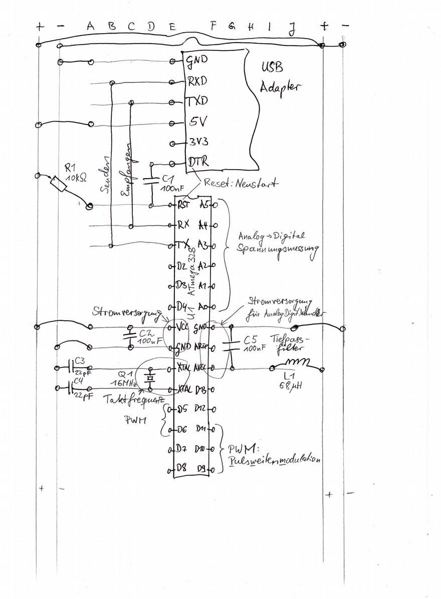

# Bauanleitung Steckbrett-Duino

Der Arduino Uno (https://store.arduino.cc/arduino-uno-rev3) ist ein Mini-Computer, der sich Dank der Arduino-Umgebung sehr leicht programmieren lässt. Aber ohne Erweiterungsplatinen ist der Arduino an sich sehr langweilig. Wir bauen stattdessen so einen Arduino selber auf einem Steckbrett nach und haben dann auf diesem Steckbrett noch viel Platz für eigene Erweiterungen.

Der Kopf des Arduino-Nachbaus ist der ATmega328P Micro-Controller. Dieser enthält einen Prozessor der unsere Programme abarbeiten kann, Speicher um sich unser Programm und den aktuellen Zustand merken zu können, sowie einige Ein-Ausgabe-Beinchen über die der Micro-Controller mit der Außenwelt und unseren Erweiterungen interagieren kann.

Der zweite wichtige Bestandteil ist ein USB-zu-Seriell Adapter der unseren Mini-Computer aus einem USB-Anschluss mit elektrischem Strom versorgt und Kommunikation zwischen der Arduino-Umgebung auf einem Computer und unserem Micro-Controller ermöglicht.

Hinzu kommen einige Drahtverbindungen und ein paar Hilfsbauteile. Im Folgenden wird ihre Platzierung und ihre Rolle in unserem Mini-Computer beschrieben. Die Erklärungen zu Hintergründen der Bauteile sind in separaten Unterabschnitten und können bei Ungeduld oder Zeitmangel übersprungen werden.

## Schaltplan im Überblick

Auf dem Schaltplan ist zu sehen, welche Beine der Bauteile über Drahtbrücken miteinander verbunden werden müssen. Zudem sind die Teile genau wie auf dem Steckbrett angeordnet. Der Übersichtlichkeit zuliebe sind nicht alle Löcher des Steckbretts gezeichnet. Die Löcher sind jeweils in jeder Zeile auf der linken sowie separat auf der rechten Hälfte des Steckbretts miteinander verbunden. Da kann jedes Loch der selben Zeile gleichberechtigt benutzt werden -- es muss also nicht unbedingt das Loch direkt neben dem Bauteil-Beinchen sein.

Ganz links und ganz rechts hat das Steckbrett je eine + und eine - Spalte für die Stromversorgung. Die Löcher der + Spalte sind miteinander verbunden sowie die Löcher der - Spalte. Wir werden später Drahtbrücken hinzufügen, um die linke + Spalte mit der rechten + Spalte zu verbinden.

Achtung: Manche Steckbretter sind zusätzlich in eine untere und obere Hälfte geteilt. Dann sind die Löcher der + Spalte oben und der + Spalte unten nicht miteinander verbunden, ebenso bei den anderen Spalten der Stromversorgung. In diesem Fall brauchen wir kurze Drahtbrücken von oben nach unten, um diese Spalten jeweils miteinander zu verbinden.

## Schritt 1) USB-Adapter und Micro-Controller platzieren

Den USB-Adapter platzieren: In der Spalte E ziemlich weit oben auf dem Steckbrett. Der Micro-Controller kommt direkt darunter so dass eine Zeile Abstand zum USB-Adapter ist und die einen Beinchen in Spalte E und die anderen Beinchen in Spalte F sind.

Jetzt können wir links (Spalte A-D) die Löcher des Steckbretts verwenden, um Verbindungen zu den Beinchen in Reihe E herzustellen. Ebenso rechts die Spalten G-J, um etwas mit den Micro-Controller Beinchen in Spalte F zu verbinden.

## Schritt 2) Kommunikation zwischen USB und Micro-Controller

Um Daten und Programme zwischen unserem Computer und den Micro-Controller übertragen zu können, verbinden wir den Micro-Controller mit dem USB-Adapter: Eine Drahtbrücke von der Zeile mit dem RX-Beinchen des USB-Adapters zu der Zeile mit dem TX-Beinchen des Micro-Controllers. Ebenso von dem TX des USB-Adapters zum RX des Micro-Controllers.

Achtung: Manche USB-Serial Adapter haben die Beschriftung RX und TX vertauscht, so dass RX vom USB-Adapter mit RX vom Micro-Controller und TX mit TX verbunden werden müssen. Bei unbekannten Adaptern hilft ausprobieren.

### Von TX nach RX

RX steht für Receive, also Empfangen, und TX für Transmit, also Senden. In der einen Kommunikationsrichtung sendet also der Micro-Controller Signale auf das TX-Beinchen. Durch die Drahtbrücke kommen diese Signale zum RX-Bein des USB-Adapters. Diese Empfängt die Signale, und übersetzt sie in USB-Signale für die Verbindung über die USB-Leitung zum großen Computer. In die andere Richtung empfängt der USB-Adapter USB-Signale vom Computer, übersetzt diese in ein einfacheres Signal zum Senden auf seinem TX-Bein. Das ist über die Drahtbrücke mit dem RX-Bein des Micro-Controllers verbunden, so dass dieser das Signal empfängt.

### Asynchrone Serielle Übertragung

Für die Datenübertragung vom TX-Bein zum RX-Bein kann die Senderseite lediglich die Spannung verändern. Spannungen unter ca. 0.3*Vcc werden am Eingang als LOW erkannt und Spannungen über ca. 0.6*Vcc als HIGH.

Für die Datenübertragung als binäre Zahlen werden nur die zwei Ziffern 0 und 1 gebraucht. LOW kann als 0 interpretiert werden und HIGH als 1. Dann lassen sich Daten als Folgen von 0 und 1 Binärziffern (sogenannten Bits) bzw. LOW und HIGH Spannungspegeln übertragen. Diese Übertragung von Bits nacheinander über die selbe Leitung wird serielle Übertragung genannt. Im Vergleich dazu werden bei paralleler Übertragung separate Leitungen benutzt um mehrere Bits gleichzeitig übertragen zu können.

Aber wann soll am Eingang (dem RX-Beinchen) die Spannung abgelesen werden? Dafür gibt es viele Übertragungsstandards mit verschiedenen Vor- und Nachteilen. Bei synchronen Übertragungsarten wird eine separate Takt-Leitung benutzt, über die der Sender dem Empfänger signalisiert, wann die Daten-Leitung den richtigen Spannungspegel für das nächste Bit hat. Bei asynchronen Übertragungsarten gibt es keine Takt-Leitung.

In unserem Fall wird RS-232 (https://de.wikipedia.org/wiki/RS-232) verwendet, allerdings mit kleineren Spannungen. Jede Übertragung beginnt mit einem Start-Bit bei dem die Spannung auf der Leitung von LOW zu HIGH wechselt. Dieser Wechsel signalisiert dem Empfänger, dass es jetzt los geht. Der Empfänger startet dann seinen Taktgenerator und liest zu jedem Taktschlag die Spannung (LOW oder HIGH) am RX-Bein als ein Daten-Bit (0 oder 1).

Damit dies wirklich funktioniert müssen sich Sender und Empfänger einig sein über die Übertragungsgeschwindigkeit (Baud-Rate), also wie lange ein übertragenes Bit auf der Leitung liegt. Beim unserem Micro-Controller lassen sich 300, 600, 1200, 2400, 4800, 9600, 14400, 19200, 28800, 38400, 57600 oder 115200 Bit pro Sekunde einstellen.

Weil die Taktgeneratoren von Sender und Empfänger niemals perfekt gleich schnell laufen, driften beide auseinander. Deswegen können nur eine kleine Anzahl Daten-Bits übertragen werden und dann muss ein neues Start-Bit zur Synchronisation übertragen werden. Es können auch noch weitere sogenannte Parity-Bits zur Erkennung von Übertragungsfehlern dazu kommen. Auch darüber müssen sich Sender und Empfänger einig sein. Bei uns sind die Nachrichten so aufgebaut: 1 Start-Bit, 8 Daten-Bits, keine Parity-Bits, 1 Stop-Bit.

Zum Glück müssen wir das alles nicht selber machen. Der Micro-Controller und der USB-Adapter machen das für uns, solange wir auf beiden Seiten die selbe Baud-Rate einstellen.

TODO eine Skizze wo Start-Bit, Daten-Bits, Parity-Bit und Stop-Bit sowie der auf Empfängerseite generierte Takt zu sehen sind.

### Asynchrone Serielle Übertragung in der Computertechnik

Die Netzwerkkarte und die Graphikkarte im Computer sind über Leitungen basierend auf dem PCIe Übertragungsstandard mit dem Prozessor verbunden. Dies verwendet auch so eine serielle Übertragung, aber mit viel schnelleren Datenraten und mehr Daten-Bits pro Übertragung. Damit der Taktgenerator des Empfängers bei dieser schnellen Übertragungsgeschwindigkeit noch gut genug zum Takt des Senders passt, wird nicht nur ein einziges Start-Bit als LOW-HIGH Übergang gesendet. Stattdessen werden mehrere Start-Bits als eine 010101010101...-Folge gesendet so dass der Taktgenerator des Empfängers mehr Zeit hat, sich auf dieses Muster einzuschwingen. Diese Strategie wird auch bei der Übertragung über Ethernet-Netzwerkkabel verwendet.

## Schritt 3) Stromversorgung verbinden

Das "GND" Beinchen des USB-Adapters wird über eine Drahtbrücke mit der linken - Spalte verbunden (meist blau markiert). Das "5V" Beinchen des USB-Adapters mit der linken + Spalte (meist rot markiert).

Dann kommen zwei lange Drahtbrücken, um die linke + Spalte mit der rechten + Spalte zu verbinden und ebenso die linke - Spalte mit der rechten - Spalte. Nun sind die senkrechten Strom-Spalten des Steckbretts mit der Stromquelle aus dem USB-Adapter verbunden.

Als nächstes kann nun der Micro-Controller mit Strom versorgt werden. Dazu von der + Spalte eine Drahtbrücke zu der Zeile in der das "VCC" Beinchen des Micro-Controllers steckt. Und von der - Spalte eine Drahtbrücke zu der Zeile in der das "GND" Beinchen des Micro-Controllers steckt.

### GND, Ground, Masse, Erde, 0V und so

TODO

## Schritt 4) Energiepuffer in der Stromversorgung

Ein 100nF Kondensator (C2) verbindet die beiden Zeilen des VCC und GND Beinchen des Micro-Controllers.

### Kondensatoren als Energiespeicher

Die Aufgabe des Kondensators C2 ist es, elektrische Energie aus der Energieversorgung zu speichern und vor Ort an den Micro-Controller abzugeben, wenn dieser Energie braucht. Das ist ähnlich wie ein Wasser-basiertes Pumpspeicherkraftwerk das bei Verbrauchsspitzen im Stromnetz für kurze Zeit eingeschaltet wird.

Elektrische Kondensatoren sind zwei Metallplatten mit einem isolierenden Material dazwischen. Wenn man einen elektrische Spannungsunterschied an den Platten erzeugt, baut sich zwischen beiden ein elektrisches Kraftfeld auf und dieses speichert elektrische Energie. Dieser Spannungsunterschied entsteht wenn wir eine der Platten mit dem + und die andere mit dem - unserer Stromquelle verbinden.

Die gespeicherte Energie wächst mit dem Spannungsunterschied zwischen beiden Platten. Wird der Unterschied kleiner, wird auch das Feld schwächer und es gibt elektrische Energie zurück in den Stromkreis. Genau dies passiert wenn der Prozessor kurzzeitig Energie braucht. Dann fließt elektrischer Strom aus dem Kondensator wie aus einer kleinen Batterie in den Prozessor. Später lädt sich der Kondensator über unsere eigentliche Stromversorgung wieder auf.

### Prozessoren arbeiten in Schritten

Der Prozessor besteht im Prinzip aus einem Kreislauf in dem sich Zwischenspeicher (sogenannte Register) und Logikbausteine (z.B. UND-, ODER-Verknüpfungen und logische Negation) abwechseln. In jedem Arbeitsschritt lesen die Logikbausteine aus ihren Eingangsregistern, verknüpfen die Informationen und schreiben das Ergebnis in ihr Ausgangsregister.

Dies passiert dadurch das elektrischer Strom fließt, der die vielen kleinen elektrischen Schalter, die Transistoren, auf dem Weg von Eingangsregister zu Ausgangsregister passend umschaltet. Das passiert im Wesentlichen am Anfang jedes Arbeitsschritts. Die restliche Zeit bis zum nächsten Arbeitsschritt besteht vor allem aus Warten auf die langsamsten Transistoren oder den längsten Pfad von Ein- zu Ausgangsregister. Dadurch verbraucht der Prozessor am Anfang eines jeden Arbeitsschritts viel elektrische Energie und dann wieder ganz wenig.

Dieser ungleichmäßige Energieverbrauch führt dazu, dass am Anfang jeden Arbeitsschritts viel Strom durch den Micro-Controller fließt und dann wieder sehr wenig. Diese Änderungen des Stromflusses sind nicht schön, weil sie auf dem kompletten Weg wie bei einer Antenne elektro-magnetische Wellen in die Welt strahlen. Die können uns dann an anderen Stellen wieder stören. Dieser Strom fließt aus der Stromquelle im Computernetzteil über den 5V-Draht im USB-Kabel, die beiden Drahtbrücken von "5V" Bein am USB-Adapter zur + Spalte des Steckbretts und von dort zum "VCC" Bein des Micro-Controller. Und dann wieder über das "GND" Bein, die - Spalte, das GND-Bein am USB-Adapter und den GND-Draht im USB-Kabel zurück.

Der kleine Kondensator am VCC und GND Beinchen des Micro-Controllers sorgt für einen kontinuierlicheren Stromverbrauch und verringert die störenden Abstrahlungen.

## Schritt 5) 16MHz Taktgenerator anschließen

## Schritt 6) Automatischer Neustart

## Schritt 7) Stromversorgung für den Analog-Spannungsmesser
