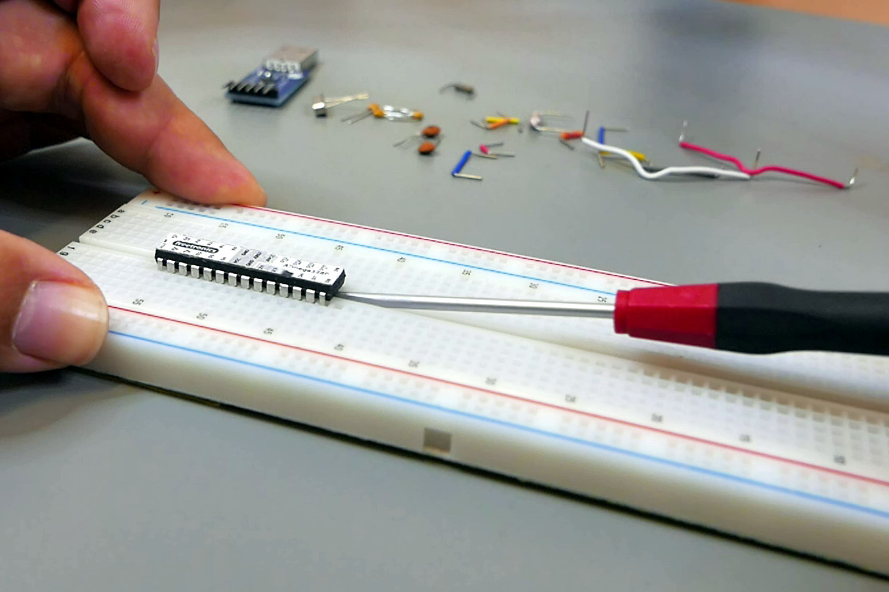

# Bauanleitung Steckbrett-Duino

Der Arduino Uno (https://store.arduino.cc/arduino-uno-rev3) ist ein Mini-Computer, der sich Dank der Arduino-Umgebung sehr leicht programmieren lässt. Aber ohne Erweiterungsplatinen ist der Arduino an sich sehr langweilig. Wir bauen stattdessen so einen Arduino selber auf einem Steckbrett nach und haben dann auf diesem Steckbrett noch viel Platz für eigene Erweiterungen.

Der Kopf des Arduino-Nachbaus ist der ATmega328P Micro-Controller. Dieser enthält einen Prozessor der unsere Programme abarbeiten kann, Speicher um sich unser Programm und den aktuellen Zustand merken zu können, sowie einige Ein-Ausgabe-Beinchen über die der Micro-Controller mit der Außenwelt und unseren Erweiterungen interagieren kann.

Der zweite wichtige Bestandteil ist ein USB-zu-Seriell Adapter der unseren Mini-Computer aus einem USB-Anschluss mit elektrischem Strom versorgt und Kommunikation zwischen der Arduino-Umgebung auf einem Computer und unserem Micro-Controller ermöglicht.

Hinzu kommen einige Drahtverbindungen und ein paar Hilfsbauteile. Im Folgenden wird ihre Platzierung und ihre Rolle in unserem Mini-Computer beschrieben. Die Erklärungen zu Hintergründen der Bauteile sind in separaten Unterabschnitten und können bei Ungeduld oder Zeitmangel übersprungen werden.

## Schaltplan im Überblick

Auf dem Schaltplan ist zu sehen, welche Beine der Bauteile über Drahtbrücken miteinander verbunden werden müssen. Zudem sind die Teile genau wie auf dem Steckbrett angeordnet. Der Übersichtlichkeit zuliebe sind nicht alle Löcher des Steckbretts gezeichnet. Die Löcher sind jeweils in jeder Zeile auf der linken sowie separat auf der rechten Hälfte des Steckbretts miteinander verbunden. Da kann jedes Loch der selben Zeile gleichberechtigt benutzt werden -- es muss also nicht unbedingt das Loch direkt neben dem Bauteil-Beinchen sein.

Ganz links und ganz rechts hat das Steckbrett je eine + und eine - Spalte für die Stromversorgung. Die Löcher der + Spalte sind miteinander verbunden sowie die Löcher der - Spalte. Wir werden später Drahtbrücken hinzufügen, um die linke + Spalte mit der rechten + Spalte zu verbinden.

Achtung: Manche Steckbretter sind zusätzlich in eine untere und obere Hälfte geteilt. Dann sind die Löcher der + Spalte oben und der + Spalte unten nicht miteinander verbunden, ebenso bei den anderen Spalten der Stromversorgung. In diesem Fall brauchen wir kurze Drahtbrücken von oben nach unten, um diese Spalten jeweils miteinander zu verbinden.

## Schritt 1) USB-Adapter und Micro-Controller platzieren

Den USB-Adapter platzieren: In der Spalte E ziemlich weit oben auf dem Steckbrett. Der Micro-Controller kommt direkt darunter so dass eine Zeile Abstand zum USB-Adapter ist und die einen Beinchen in Spalte E und die anderen Beinchen in Spalte F sind.

Jetzt können wir links (Spalte A-D) die Löcher des Steckbretts verwenden, um Verbindungen zu den Beinchen in Reihe E herzustellen. Ebenso rechts die Spalten G-J, um etwas mit den Micro-Controller Beinchen in Spalte F zu verbinden.

Achtung: Die Beinchen des Micro-Controllers stehen zu weit auseinander und passen so nicht in die richtigen Löcher auf dem Steckbett. Man kann die Beinchen auf jeder Seite vorsichtig (!) ein Stückchen weiter nach innen biegen, indem man den Micro-Controller seitlich auf die Tischplatte drückt.

Achtung: Der Micro-Controller steckt am Anfang noch nicht richtig in den Löchern drin, so dass einige der Beinchen nicht richtig Kontakt zu den Klammern in ihrem Steckbrett-Loch haben. Unbedingt mit Kraft auf den Micro-Controller drücken so dass er im Steckbrett einrastet. Vorher natürlich gucken, dass alle Beinchen im richtigen Loch sind.

Achtung: Beim Herausziehen des Micro-Controllers kann es sehr schnell passieren, dass er sich ungleichmäßig zuerst nur auf einer Seite löst. Das verbiegt die Beinchen am anderen Ende. Sicherer ist es, den Micro-Controller vorsichtig mit einem dünnen Schraubendreher abwechselnd am unteren und oberen Ende hoch zu hebeln bis er sich aus dem Steckbrett löst.

## Schritt 2) Kommunikation zwischen USB und Micro-Controller

Um Daten und Programme zwischen unserem Computer und den Micro-Controller übertragen zu können, verbinden wir den Micro-Controller mit dem USB-Adapter: Eine Drahtbrücke von der Zeile mit dem RX-Beinchen des USB-Adapters zu der Zeile mit dem TX-Beinchen des Micro-Controllers. Ebenso von dem TX des USB-Adapters zum RX des Micro-Controllers.

Achtung: Manche USB-Serial Adapter haben die Beschriftung RX und TX vertauscht, so dass RX vom USB-Adapter mit RX vom Micro-Controller und TX mit TX verbunden werden müssen. Bei unbekannten Adaptern hilft ausprobieren. Eine Leuchtdiode zwischen TX und GND leuchtet, falls sie richtig herum eingesetzt ist. Zwischen RX und GND leuchtet sie nicht. Das liegt daran, dass das TX-Beinchen zum Senden im Normalzustand mit 3.3V oder 5V verbunden ist.

### Von TX nach RX

RX steht für Receive, also Empfangen, und TX für Transmit, also Senden. In der einen Kommunikationsrichtung sendet also der Micro-Controller Signale auf das TX-Beinchen. Durch die Drahtbrücke kommen diese Signale zum RX-Bein des USB-Adapters. Diese Empfängt die Signale, und übersetzt sie in USB-Signale für die Verbindung über die USB-Leitung zum großen Computer. In die andere Richtung empfängt der USB-Adapter USB-Signale vom Computer, übersetzt diese in ein einfacheres Signal zum Senden auf seinem TX-Bein. Das ist über die Drahtbrücke mit dem RX-Bein des Micro-Controllers verbunden, so dass dieser das Signal empfängt.

### Asynchrone Serielle Übertragung

Für die Datenübertragung vom TX-Bein zum RX-Bein kann die Senderseite lediglich die Spannung verändern. Spannungen unter ca. 0.3*Vcc werden am Eingang als LOW erkannt und Spannungen über ca. 0.6*Vcc als HIGH.

Für die Datenübertragung als binäre Zahlen werden nur die zwei Ziffern 0 und 1 gebraucht. LOW kann als 0 interpretiert werden und HIGH als 1. Dann lassen sich Daten als Folgen von 0 und 1 Binärziffern (sogenannten Bits) bzw. LOW und HIGH Spannungspegeln übertragen. Diese Übertragung von Bits nacheinander über die selbe Leitung wird serielle Übertragung genannt. Im Vergleich dazu werden bei paralleler Übertragung separate Leitungen benutzt um mehrere Bits gleichzeitig übertragen zu können.

Aber wann soll am Eingang (dem RX-Beinchen) die Spannung abgelesen werden? Dafür gibt es viele Übertragungsstandards mit verschiedenen Vor- und Nachteilen. Bei synchronen Übertragungsarten wird eine separate Takt-Leitung benutzt, über die der Sender dem Empfänger signalisiert, wann die Daten-Leitung den richtigen Spannungspegel für das nächste Bit hat. Bei asynchronen Übertragungsarten gibt es keine Takt-Leitung.

In unserem Fall wird RS-232 (https://de.wikipedia.org/wiki/RS-232 und https://de.wikipedia.org/wiki/Universal_Asynchronous_Receiver_Transmitter) verwendet, allerdings mit kleineren Spannungen. Jede Übertragung beginnt mit einem Start-Bit bei dem die Spannung auf der Leitung von LOW zu HIGH wechselt. Dieser Wechsel signalisiert dem Empfänger, dass es jetzt los geht. Der Empfänger startet dann seinen Taktgenerator und liest zu jedem Taktschlag die Spannung (LOW oder HIGH) am RX-Bein als ein Daten-Bit (0 oder 1).

Damit dies wirklich funktioniert müssen sich Sender und Empfänger einig sein über die Übertragungsgeschwindigkeit (Baud-Rate), also wie lange ein übertragenes Bit auf der Leitung liegt. Beim unserem Micro-Controller lassen sich 300, 600, 1200, 2400, 4800, 9600, 14400, 19200, 28800, 38400, 57600 oder 115200 Bit pro Sekunde einstellen.

Weil die Taktgeneratoren von Sender und Empfänger niemals perfekt gleich schnell laufen, driften beide auseinander. Deswegen können nur eine kleine Anzahl Daten-Bits übertragen werden und dann muss ein neues Start-Bit zur Synchronisation übertragen werden. Es können auch noch weitere sogenannte Parity-Bits zur Erkennung von Übertragungsfehlern dazu kommen. Auch darüber müssen sich Sender und Empfänger einig sein. Bei uns sind die Nachrichten so aufgebaut: 1 Start-Bit, 8 Daten-Bits, keine Parity-Bits, 1 Stop-Bit.

Zum Glück müssen wir das alles nicht selber machen. Der Micro-Controller und der USB-Adapter machen das für uns, solange wir auf beiden Seiten die selbe Baud-Rate einstellen.

TODO eine Skizze wo Start-Bit, Daten-Bits, Parity-Bit und Stop-Bit sowie der auf Empfängerseite generierte Takt zu sehen sind.

### Asynchrone Serielle Übertragung in der Computertechnik

Die Netzwerkkarte und die Graphikkarte im Computer sind über Leitungen basierend auf dem PCIe Übertragungsstandard mit dem Prozessor verbunden. Dies verwendet auch so eine serielle Übertragung, aber mit viel schnelleren Datenraten und mehr Daten-Bits pro Übertragung. Damit der Taktgenerator des Empfängers bei dieser schnellen Übertragungsgeschwindigkeit noch gut genug zum Takt des Senders passt, wird nicht nur ein einziges Start-Bit als LOW-HIGH Übergang gesendet. Stattdessen werden mehrere Start-Bits als eine 010101010101...-Folge gesendet so dass der Taktgenerator des Empfängers mehr Zeit hat, sich auf dieses Muster einzuschwingen. Diese Strategie wird auch bei der Übertragung über Ethernet-Netzwerkkabel verwendet.

## Schritt 3) Stromversorgung verbinden

Das "GND" Beinchen des USB-Adapters wird über eine Drahtbrücke mit der linken - Spalte verbunden (meist blau markiert). Das "5V" Beinchen des USB-Adapters mit der linken + Spalte (meist rot markiert).

Dann kommen zwei lange Drahtbrücken, um die linke + Spalte mit der rechten + Spalte zu verbinden und ebenso die linke - Spalte mit der rechten - Spalte. Nun sind die senkrechten Strom-Spalten des Steckbretts mit der Stromquelle aus dem USB-Adapter verbunden.

Als nächstes kann nun der Micro-Controller mit Strom versorgt werden. Dazu von der + Spalte eine Drahtbrücke zu der Zeile in der das "VCC" Beinchen des Micro-Controllers steckt. Und von der - Spalte eine Drahtbrücke zu der Zeile in der das "GND" Beinchen des Micro-Controllers steckt.

### GND, Ground, Masse, Erde, 0V und so

Elektrische Spannungen sind Unterschiede im Überschuss oder Mangel an Elektronen zwischen zwei Orten. Die Spannung ist also immer relativ zu einem mehr oder weniger beliebig gewählten Bezugspunkt. Die Erde wird gerne als Bezugspunkt genommen und hat dann die Spannung "0V" -- also keinen Unterschied zur Erde. Auf Englisch übersetzt ist das "Ground" und abgekürzt "GND".

Weil die Erde einen unerschöpflich erscheinenden Vorrat an frei beweglichen Elektronen hat, wird auch das Symbol "-" benutzt. Minus als Überschuss an negativ geladenen Elektronen. Positive Spannungen wie z.B. 5V werden mit + gekennzeichnet, auch wenn dort genau genommen Elektronen fehlen. Vielleicht weil dort Überschuss an positiv geladenen Protonen ist?

## Schritt 4) Energiepuffer in der Stromversorgung

Ein 100nF Kondensator (C2) verbindet die beiden Zeilen des VCC und GND Beinchen des Micro-Controllers.

### Kondensatoren als Energiespeicher

Die Aufgabe des Kondensators C2 ist es, elektrische Energie aus der Energieversorgung zu speichern und vor Ort an den Micro-Controller abzugeben, wenn dieser Energie braucht. Das ist ähnlich wie ein Wasser-basiertes Pumpspeicherkraftwerk das bei Verbrauchsspitzen im Stromnetz für kurze Zeit eingeschaltet wird.

Elektrische Kondensatoren sind zwei Metallplatten mit einem isolierenden Material dazwischen. Wenn man einen elektrische Spannungsunterschied an den Platten erzeugt, baut sich zwischen beiden ein elektrisches Kraftfeld auf und dieses speichert elektrische Energie. Dieser Spannungsunterschied entsteht wenn wir eine der Platten mit dem + und die andere mit dem - unserer Stromquelle verbinden.

Die gespeicherte Energie wächst mit dem Spannungsunterschied zwischen beiden Platten. Wird der Unterschied kleiner, wird auch das Feld schwächer und es gibt elektrische Energie zurück in den Stromkreis. Genau dies passiert wenn der Prozessor kurzzeitig Energie braucht. Dann fließt elektrischer Strom aus dem Kondensator wie aus einer kleinen Batterie in den Prozessor. Später lädt sich der Kondensator über unsere eigentliche Stromversorgung wieder auf.

### Prozessoren arbeiten in Schritten

Der Prozessor besteht im Prinzip aus einem Kreislauf in dem sich Zwischenspeicher (sogenannte Register) und Logikbausteine (z.B. UND-, ODER-Verknüpfungen und logische Negation) abwechseln. In jedem Arbeitsschritt lesen die Logikbausteine aus ihren Eingangsregistern, verknüpfen die Informationen und schreiben das Ergebnis in ihr Ausgangsregister.

Dies passiert dadurch das elektrischer Strom fließt, der die vielen kleinen elektrischen Schalter, die Transistoren, auf dem Weg von Eingangsregister zu Ausgangsregister passend umschaltet. Das passiert im Wesentlichen am Anfang jedes Arbeitsschritts. Die restliche Zeit bis zum nächsten Arbeitsschritt besteht vor allem aus Warten auf die langsamsten Transistoren oder den längsten Pfad von Ein- zu Ausgangsregister. Dadurch verbraucht der Prozessor am Anfang eines jeden Arbeitsschritts viel elektrische Energie und dann wieder ganz wenig.

Dieser ungleichmäßige Energieverbrauch führt dazu, dass am Anfang jeden Arbeitsschritts viel Strom durch den Micro-Controller fließt und dann wieder sehr wenig. Diese Änderungen des Stromflusses sind nicht schön, weil sie auf dem kompletten Weg wie bei einer Antenne elektro-magnetische Wellen in die Welt strahlen. Die können uns dann an anderen Stellen wieder stören. Dieser Strom fließt aus der Stromquelle im Computernetzteil über den 5V-Draht im USB-Kabel, die beiden Drahtbrücken von "5V" Bein am USB-Adapter zur + Spalte des Steckbretts und von dort zum "VCC" Bein des Micro-Controller. Und dann wieder über das "GND" Bein, die - Spalte, das GND-Bein am USB-Adapter und den GND-Draht im USB-Kabel zurück.

Der kleine Kondensator am VCC und GND Beinchen des Micro-Controllers sorgt für einen kontinuierlicheren Stromverbrauch und verringert die störenden Abstrahlungen.

## Schritt 5) 16MHz Taktgenerator anschließen

An die beiden XTAL-Beinchen des Micro-Controllers wird ein 16MHz Schwingquarz (Q1) angeschlossen. Je ein Bein in ein Loch der oberen Zeile und das andere Bein in die Zeile darunter. Um die Schwingung zu unterstützen kommen noch zwei 22pF Kondensatoren (C3, C4) dazu. Diese sind auf einem Bein mit der GND-Zeile darüber verbunden und auf der anderen mit jeweils einer der XTAL-Zeilen.

Alternativ können die beiden 22pF Kondensatoren auch mit einem Bein in der - Spalte links von den XTAL Zeilen stecken.

### 16 Millionen Arbeitsschritte pro Sekunde

Der Micro-Controller hat einen internen Taktgenerator der auf verschiedene Frequenzen wie z.B. 8MHz, 16MHz und höchstens 20MHz eingestellt werden kann. Allerdings läuft er nicht sehr genau. Das würde zum Beispiel Zeitmessungen und Wartezeiten in unseren Programmen ungenau machen. Schlimmer noch: Wenn der Taktgenerator zu schnell läuft, kann es passieren, dass der nächste Arbeitsschritt schon beginnt bevor alle Ergebnisse des vorherigen Arbeitsschritts fertig gespeichert sind. Das würde zu falschen Rechenergebnissen und vielem merkwürdigen Verhalten unseres Mini-Computer führen.

Der Schwingquarz stabilisiert die Schwingung des Taktgenerators. 16MHz sind 16 Millionen Schwingungen pro Sekunde, also ein Arbeitsschritt alle 62.5ns Nanosekunden. Zum Vergleich: Unsere heutigen Computer laufen je nach Arbeitslast mit 1 bis 4 GHz. Ein GHz entspricht einem Arbeitsschritt jede 1ns. Und bei 4GHz wäre ein Arbeitsschritt nur noch 0.25ns lang. Dahingegen ist unser Mini-Computer mit 16MHz recht langsam -- aber immer noch schnell genug für viele einfache Aufgaben.

Der Schwingquarz ist aus einem Quarzkristall geschnitten. Das ist ein merkwürdiges Gestein mit dem sogenannten Piezo-Elektrischen Effekt: Wenn man es verbiegt, schubst das verbogene Kristallgitter Elektronen auf eine Seite, so dass eine elektrische Spannung zwischen den Seiten entsteht. Dies wird zum Beispiel in elektronischen Wagen benutzt, um Gewichte anhand der erzeugten Spannung bestimmen zu können. Und wenn man eine elektrische Spannung an das Quarzkristall anlegt, so verbiegt es sich. Dies wird zum Beispiel bei Piezo-Lautsprechern benutzt.

Im Schwingquarz wird die Wechselwirkung zwischen elektrischer Spannung und dem Verbiegen des Kristalls ausgenutzt. Die Resonanzfrequenzen des Kristalls hängen nämlich im wesentlichen von den geometrischen Abmessungen des Kristalls ab. Unser Kristall ist so geschnitten, dass es bevorzugt bei 16MHz schwingt.

Im Englischen wird der Schwingquarz als Crystal bezeichnet und mit "XTAL" abgekürzt. "Cross-tal" klingt doch mit viel Phantasie ein bisschen wie Kristall, oder?

## Schritt 6) Automatischer Neustart

Unser Micro-Controller hat noch ein Problem: Kommen über die Serielle Verbindung (RX-Bein) Daten für das gerade laufende Programm oder soll ein neues Programm übertragen werden? Die Arduino-Lösung ist recht clever: Falls direkt nach dem Neustart des Micro-Controllers Daten kommen, ist es ein neues Programm das in den Speicher geschrieben werden soll. Falls aber eine Sekunde lange nichts kommt, dann wird das aktuell gespeicherte Programm gestartet und dieses kann nun unsere eigenen Daten auf der selben seriellen Leitung empfangen.

Nun braucht es nur noch einen Weg, um den Micro-Controller im "richtigen" Moment neu starten zu können: Dies wird mit dem 100nF Kondensator (C1) und dem 10kOhm Widerstand (R1) erreicht. Der Widerstand verbindet die senkrechte + Spalte mit der Zeile in dem das Reset-Beinchen (RST) des Micro-Controllers steckt. Der Kondensator verbindet die RST-Zeile mit der Zeile in der das DTR-Beinchen des USB-Adapters steckt.

### Von Data-Transmission-Ready zum Neustarten

Das DTR-Beinchen des USB-Adapters steht für "Data Transmission Ready", auf Deutsch "Daten-Transfer beginnt". Normalerweise ist es auf HIGH-Spannung, was am USB-Adapter 3.3V ist. Solange am Computer ein Programm die serielle Verbindung des USB-Adapters öffnet, wechselt das DTR-Beinchen auf LOW-Spannung, also 0V.

Der Wechsel von 3.3V zu 0V am DTR-Beinchen führt dazu, dass der Spannungsunterschied zwischen den beiden Beinen des Kondensators (C1) größer wird und deswegen das elektrische Feld im Kondensator wachsen will. Dies führt dazu, dass ein Aufladestrom von der + Spalte (5V) über den 10kOhm Widerstand (R1) in den Kondensator fließt.

Der Kondensator lädt sich aber schneller auf als Strom über den Widerstand nachfließen kann. Deswegen bricht für einen Moment die Spannung in der Mitte zwischen Widerstand und Kondensator zusammen auf fast 0V. Genau dort ist das RST-Bein des Micro-Controllers angeschlossen. Dieser kurzzeitige Wechsel der Spannung auf fast 0V sorgt dafür, dass der Micro-Controller einen Reset macht, also neu startet.

Am Ende der Datenübertragung wechselt DTR von 0V zurück auf 3.3V. Der Spannungsunterschied wird kleiner und nun ist im Kondensator das elektrische Feld zu groß, er entlädt sich. Das sich verkleinernde elektrische Feld führt zu einer höheren Spannung am RST-Bein (5V+3.3V), bis die überschüssige Energie wieder über den Widerstand R1 und die Schutzschaltung im RST-Anschluss abgeflossen ist. Dem RST-Bein ist das zum Glück egal.

## Schritt 7) Stromversorgung für den Analog-Spannungsmesser

Der Micro-Controller hat 6 Analog-Eingänge (A0 bis A5) an denen er kleine Spannungen relativ zum GND Anschluss messen kann. Um die Messgenauigkeit verbessern zu können, haben die Analog-Digital-Wandler eine separate Stromversorgung an den zwei AVCC und AGND Beinchen auf der rechten Seite.

Die einfachste Variante für die Analog-Stromversorgung ist, eine Drahtbrücke von der - Spalte zur Zeile mit dem GND-Beinchen und eine Drahtbrücke von der + Spalte zur Zeile mit dem AVCC-Beinchen.

Manche Anleitungen empfehlen einen Tiefpass-Filter der hoch-frequente störende Schwingungen aus der Stromversorgung herausfiltert. Dazu wird anstelle der Drahtbrücke von der + Spalte zur AVCC-Zeile eine Drosselspule (L1, z.B. 68mH) eingesetzt, sowie ein 100nF Kondensator (C5) von der GND-Zeile zur AVCC-Zeile. Die Drahtbrücke von der - Spalte zur AGND-Zeile bleibt bestehen.

### Tiefpass-Filter aus Spulen und Kondensatoren

Die 5V Gleichspannung, die wir vom USB-Adapter bekommen, ist gar nicht so konstant wie man denken würde. Die Spannung schwankt durch etwas durch den schwankenden Stromverbrauch des Micro-Controllers, des USB-Adapters und anderer Komponenten zwischen Netzteil und USB-Kabel. Zudem sind oft noch Reste der 50Hz Netzfrequenz den 5V beigemischt, weil das Computernetzteil die nicht perfekt weg-geglättet hat. Den meisten USB-Geräten ist das ja auch egal -- nur bei den Spannungsmessungen kann das auffallen.

Wenn elektrischer Strom durch einen Draht fließt, baut sich um den Draht ein Magnetfeld auf. Dieses speichert Energie ähnlich wie beim elektrischen Feld im Kondensator. Wird der Draht zu einer Spule aufgewickelt, verstärkt dies das Magnetfeld durch die vielen parallel liegenden Drahtabschnitte. Das magnetische Feld wächst und schrumpft abhängig vom Stromfluss. Änderungen im Stromfluss führen zu einer Änderung des Magnetfelds und die dafür notwendige Energie wird aus dem elektrischen Strom genommen. Dies wirkt als Widerstand auf sich verändernde Ströme. Dieser Widerstand wächst mit der Frequenz der Stromschwankungen. Hohe Frequenzen fließen schlecht durch die Spule.

Der Kondensator reagiert auf Schwankungen der Spannung. Bei steigender Spannung wächst das elektrische Feld im Kondensator. Dies nimmt dabei Energie auf, so dass die Spannung weniger stark anwächst als ohne Kondensator. Eine andere Betrachtungsweise ist, dass schnelle Spannungsschwankungen den Kondensator besser Auf- und Entladen als langsame Schwankungen. Es fließt mit steigender Frequenz also ein größer werdender Strom über den Kondensator. Für hochfrequente Spannungsschwankungen ist der Kondensator ein kleiner Widerstand, so dass diese nach Ground abfließen.

Für hohe Frequenzen ist die Spule vom + der Stromquelle zum AVCC des Micro-Controllers ein großer Widerstand und der Kondensator von AVCC zu GND ein kleiner Widerstand. Hoch-frequente Schwankungen werden daher unterdrückt, so dass die Spannung an AVCC stabiler ("konstanter") ist.

Wechselwirkungen zwischen Spule und Kondensator können dazu führen, dass elektrische Energie zwischen beiden hin- und her schwingt. Das wäre nicht gewünscht. Die Drosselspulen sind deswegen so gebaut, dass sie die Energie im magnetischen Feld nicht perfekt speichern und wieder abgeben, sondern möglichst viel davon in Wärme umwandeln.

### Schwingen im Gleichtakt

Der Analog-Digital-Wandler misst das Verhältnis zwischen der Spannung am Analog-Eingang und einer Referenzspannung. Diese Referenzspannung kann beim unserem Micro-Controller auf sehr stabile 1.1V eingestellt werden, ansonsten werden die ca. 5V vom AVCC Bein auch als Referenz verwendet. Bei der voreingestellten Messauflösung von 10 Bit bedeutet ein Messergebnis von 1023 das am Eingang die selbe Spannung war wie die Referenzspannung. Der Wert 512 entspricht der Hälfte der Referenzspannung, also 2.5V, und 256 einem Viertel der Referenzspannung.

    V_gemessen = messwert * V_referenz / 1023

In manchen Aufbauten schwankt die Spannung am Analog-Eingang weil die Versorgungsspannung von dem was man da angeschlossen hat selbst schon schwankt. Mit einem guten Tiefpassfilter an AVCC sieht man diese Schwankungen als Rauschen in den Messwerten. In diesem Fall kann das gemessene Rauschen durchaus kleiner werden, wenn man AVCC erst gar nicht aufwendig filtert sondern direkt mit der selben Versorgungsspannung verbindet. Der Analog-Digital-Wander misst das Verhältnis zwischen der Eingangsspannung und der Referenzspannung. Wenn beide gleich schwanken, ist das im Verhältnis nicht zu sehen weil das gleich bleibt :)
