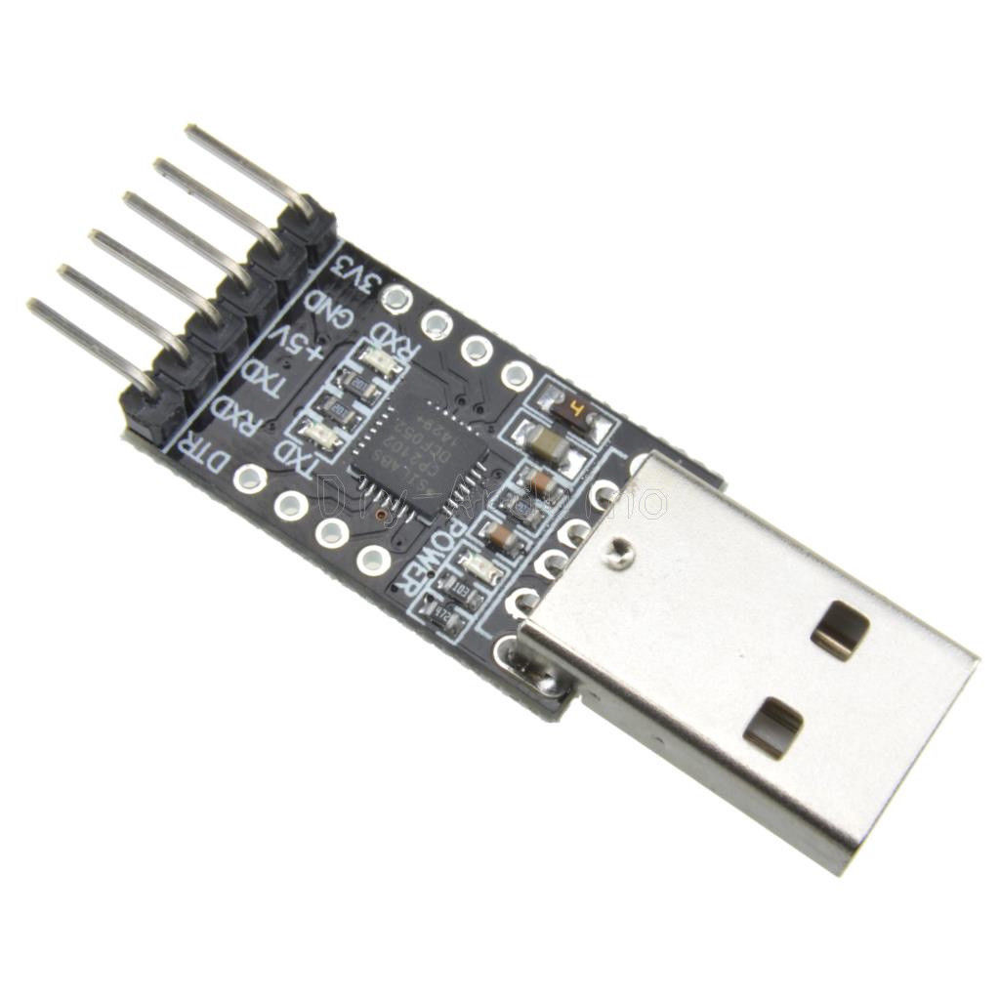

# Materialien und Beschaffungsquellen für den Steckbrett-Mini-Computer

## Steckbretter allgemein

Bezugsquelle | Bestellnummer | Einzelpreis | Beschreibung
-------------|---------------|------------:|---------------
Reichelt     | STECKBOARD 1K2V | 3,80 | Experimentier-Steckboard 640/200 Kontakte
Reichelt     | STECKBOARD DBS  | 4,60 | Steckbrücken-Drahtbrücken-Set
Pollin       | 511170          | 7,95 | Labor-Steckboard mit 140 Steckbrücken DAYTOOLS SBS-830/140
Pollin       | 510523          | 3,95 | Steckbrücken-Sortiment

Von dem Steckbrett/Steckboard/Breadboard wird pro Mini-Computer eines gebraucht. Das 1K2V von Reichelt hat eine bessere Qualität als das 511170 von Pollin. Ein Steckbrücken-Set mit steifen Drähten ist unerlässlich für den Grundaufbau. Zum Beispiel das "STECKBOARD DBS" von Reichelt oder 510523 von Pollin oder das Set 510523 von Pollin.

Bezugsquelle | Bestellnummer | Einzelpreis | Beschreibung
-------------|---------------|------------:|---------------
Reichelt     | DEBO KABELSET | 3,85 | Steckbrückenkabel-Set
Pollin       | 511007        | 3,50 | Steckbrücken-Sortiment, 65-teilig
Pollin       | 511159        | 2,95 | Steckboard-Verbindungsleitungen, Kupplung/Kupplung, 40-polig
Pollin       | 511158        | 2,95 | Steckboard-Verbindungsleitungen, Stecker/Kupplung, 40-polig
Pollin       | 511157        | 2,95 | Steckboard-Verbindungsleitungen, Stecker/Stecker, 40-polig

Von den flexiblen Testkabeln braucht man meist nicht so viele, weil die auf Dauer doch zu wackelig sind. Allerdings sind sie sehr nützlich, um Verbindungen zu Bauteilen die nicht auf das Steckbrett passen herzustellen. Es gibt die flexiblen Kabel als Stecker-Stecker (männlich-männlich), Stecker-Buchse (männlich-weiblich) und Buchse-Buchse (weiblich-weiblich).

## Bauteile für den Mini-Computer ohne Erweiterungen

Die Mengenangaben in der folgenden Tabelle beziehen sich auf einen einzelnen Mini-Computer. Bei den Kleinteilen ist es sinnvoll, etwas mehr zu bestellen. Auch einen kaputten Schwingquarz hat es schon mal gegeben.

Bezugsquelle | Bestellnummer | Einzelpreis | Menge | Beschreibung
-------------|---------------|------------:|------:|--------
Reichelt     | ATMEGA 328P-PU  |  2,20 | 1 | der Micro-Controller
Reichelt     | 16,0000-HC49U-S |  0,22 | 1 | Schwingquarz 16MHz
Reichelt     | KERKO 22P       |  0,05 | 2 | Kondensator 22pF
Reichelt     | Z5U-2,5 100N    |  0,04 | 3 | Kondensator 100nF
Reichelt     | SMCC 68µ        |  0,26 | 1 | Drosselspule 68µH
Reichelt     | AK 669-1,8      |  1,15 | 1 | USB-Verlängerungskabel A-Stecker zu A-Buchse, 1,8 m
Reichelt     | AK 676-AA2      |  1,95 | - | USB 2.0 Kabel, A Stecker auf Micro A Stecker, 1,8 m
Reichelt     | 1/4W 10K        |  0,10 | 1 | Widerstand 1/4W, 10 K-Ohm
Ebay         | CP2102 / CP2104 |  1,10 | 1 | USB to UART TTL Converter mit DTR Pin statt RST!

Es gibt bei Ebay preisgünstige "USB UART Serial Adapter" mit dem CP2102 oder dem CP2104 Schaltkreis. Die gibt es inzwischen auch mit Micro-USB Buchse. Die Direktimporte aus China kosten ca. 1,10 pro Stück und die Lieferung dauert mindestens 4 Wochen. Bei Deutschen Ebay-Händlern bekommt man sie für ca. 4 Euro, aber dafür ist die Wartezeit geringer und Rechnung mit korrekter Steuernummer möglich. Wichtig ist, dass die Adapter das DTR-Bein haben und sich ins Steckbrett stecken lassen.

* http://stores.ebay.de/eckstein-komponente
* http://stores.ebay.de/modulink

## Arduino Pro Mini, Arduino Nano und co

Als Abkürzung gibt es den "Arduino Pro Micro 5V/16MHz Leonardo" mit Micro-USB Anschluss und integriertem USB-Adapter für ca. 8 Euro. Ebenso den "Arduino Nano" für ca. 6 Euro mit USB-Kabel. An beide lassen sich Stiftleisten anlöten so dass sie in das Steckbrett gesteckt werden können. Es kann ganz nützlich sein, einen davon als initiales Programmier-Gerät für unbeschriebene ATmega und ATtiny Mico-Controller zu haben.

## Werkzeuge allgemein

Folgende Werkzeuge sind recht hilfreich:
* Seitenschneider für dünne Drähte, zum Beispiel um Beine von Bauteilen zu kürzen
* kleiner Schraubenzieher zum vorsichtigen Heraushebeln von Schaltkreisen, Bauteilen und Drahtbrücken
* eine Abisolierzange
* eine lange Flach- oder Flachrundzange

### Seitenschneider

Bezugsquelle | Bestellnummer | Einzelpreis | Beschreibung
-------------|---------------|------------:|---------------
Pollin       | 500099        |  2,95 | Elektronik-Seitenschneider
Reichelt     | SCHERE 570    |  2,99 | Kabelschere, 130 mm
Reichelt     | MAN 10701     |  3,80 | Seitenschneider, 115 mm
Reichelt     | RND 550-00052 |  8,20 | Seitenschneider, 132 mm bis 1mm Durchmesser

Bei den Kneifzangen/Seitenschneider sollte man beachten, dass sie oft nur bis 1mm Durchmesser Kupferdraht ausgelegt sind. Alles dickere und härtere Metalle machen die Zangen schnell kaputt. Die billige Zange von Pollin hält, wenn man sie ausschließlich für normale Drähte und Bauteil-Beine benutzt. Die teureren Seitenschneider schneiden besser und präziser und sind robuster.

### Flachzange

Bezugsquelle | Bestellnummer | Einzelpreis | Beschreibung
-------------|---------------|------------:|---------------
Pollin       | 500351        | 17,45 | VDE-Telefonzange - 205 mm
Pollin       | 501506        |  2,95 | Telefonzange, 160 mm - gerade
Pollin       | 500522        |  3,25 | Spitzzange
Reichelt     | RND 550-00040 |  7,35 | Flachzange, 140 mm
Reichelt     | KN 25 01 140  | 14,95 | Flachrundzange, Radiozange, 140 mm

Die Telefonzange kann auch als Seitenschneider-Ersatz nehmen, aber man trifft damit manchmal schlecht beim Schneiden.

### Schraubendreher

Bezugsquelle | Bestellnummer | Einzelpreis | Beschreibung
-------------|---------------|------------:|---------------
Pollin       | 501057        |    4,25 | Schlitz-Schraubendreher WIHA 260-40
Reichelt     | WERA 05008006001 | 3,50 | Schraubendreher Kraftform Plus, Schlitz, 2,0 mm

### Abisolierzange

Bezugsquelle | Bestellnummer | Einzelpreis | Beschreibung
-------------|---------------|------------:|---------------
Reichelt     | STRIPPER NR.5 | 17,40 | Abisolierzange, Stripper No. 5, für Rundkabel, 0,2-6,0 mm²
Pollin       | 500060        |  4,25 | Abisolierzange

## Elektronik-Bauteile allgemein

Bezugsquelle | Bestellnummer | Einzelpreis | Beschreibung
-------------|---------------|------------:|---------------
Reichelt     | K/CAP1        | 8,75 | Set: Keramikkondensatoren, 224-teilig
Reichelt     | K/CAP2        | 8,40 | Set: Elektrolytkondensatoren, 120-teilig
Reichelt     | K/RES-E12     | 7,30 | Set: E12-Widerstände, 610-teilig
Reichelt     | K/LED1        | 8,40 | Set: LED, 80-teilig
Reichelt     | K/TRANS1      | 9,20 | Sortiment, Transistoren, 100-teilig

Als Vorwiderstände für LEDs eignen sich Werte von 180 Ohm bis 330 Ohm. Die Leuchtdioden in dem Velleman-Sortiment sind nicht besonders hell. Für effiziente LEDs lohnt sich ein Blick auf Ebay, z.B. [kt-elektronik](http://stores.ebay.de/kt-elektronic).

## für den Lötkolben

Bezugsquelle | Bestellnummer | Einzelpreis | Beschreibung
-------------|---------------|------------:|---------------
Reichelt     | SL 1X40G 2,54 | 0,18 | 40pol. Stiftleiste, gerade, RM 2,54
Reichelt     | SL 1X40W 2,54 | 0,30 | 40pol. Stiftleiste, gewinkelt, RM 2,54

Die Stiftleisten sind hervorragend um Kabel und kleine Adapter-Platinen auf das Steckbrett stecken zu können
